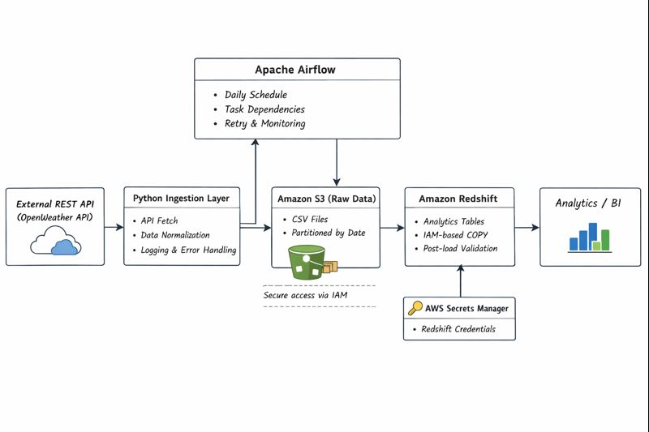

# Cloud Data Ingestion and Warehouse on AWS

## Overview

This project implements a production-style, end-to-end data engineering pipeline on AWS.

The pipeline ingests data from an external REST API, performs validation and transformation, and loads analytics-ready data into Amazon Redshift on a daily schedule.

The design follows enterprise data engineering best practices such as modular code organization, secure credential handling, data quality validation, and workflow orchestration.

---

## Architecture



### Pipeline Flow
1. External REST API (Weather API)
2. Python-based ingestion and transformation
3. Amazon S3 (raw data storage)
4. Amazon Redshift (analytics warehouse)
5. Apache Airflow (orchestration & scheduling)

### Key AWS Services Used
- Amazon S3 for raw data storage
- Amazon Redshift for analytical data warehousing
- AWS IAM for secure access control
- AWS Secrets Manager for credential management
- Apache Airflow for workflow orchestration

---

## Project Structure

```text
cloud-data-ingestion-and-warehouse-aws/
├── src/
│   ├── ingestion/        # API ingestion and transformation logic
│   ├── warehouse/        # Redshift loading and validation
│   ├── orchestration/    # Airflow DAGs
│
├── config/
│   ├── aws/              # AWS configuration
│   └── .env.example      # Environment variable template
│
├── tests/                # Validation and testing (extensible)
├── requirements.txt
└── README.md
